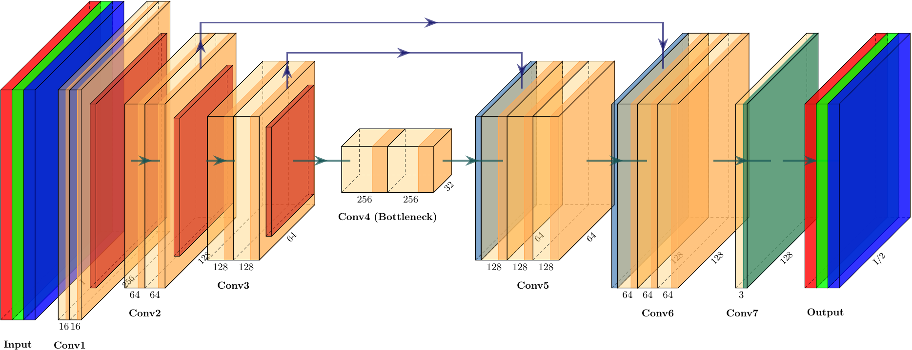

# Autoencoder for image downscaling and Mipmap Generation

This is an implementation of an autoencoder to downscale images and generate mipmaps.

The architecture of the autoencoder can be seen in this diagram:

## To run pretrained model:

The saved weights are in weights/weights_perceptual_ssim_nadam_500_0.0002_0.9_0.999_1587746299.670421

Run the test file image_downscaling/conv_autoencoder_test.py after setting the right folder where you have images.

## To train the model:

Run image_downscaling/conv_autoencoder_main.py after tweaking the parameters as you wish.

